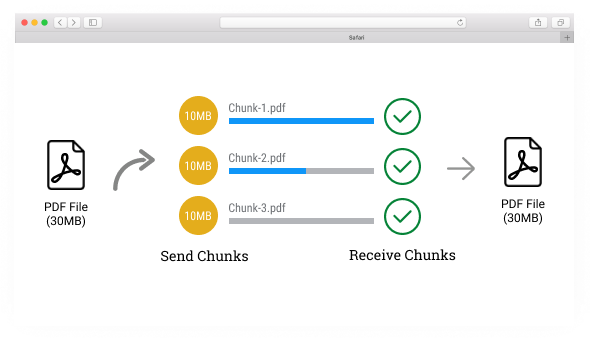

# UPLOAD CHUNKS

Ce projet permet de mettre en pratique une technique d'envoi de fichier volumineux : "**CHUNK UPLOAD**".

## Introduction

Lorsque l'utilisateur sélectionne un fichier (image, video, pdf, ...) dans un input, celui-ci peut avoir un poids conséquent. Lors de l'envoi, le client établi une requête vers un serveur. Dans le cas ou le fichier aurait une taille d'une dizaine de gigaoctets, l'utilisateur ne possédant pas d'une excellente connexion, pourrai mettre plusieurs heure à effectuer l'envoi du fichier et donc à transmettre la requête au serveur.
Cette configuration peut causée à de possibles bugs dans des environnements de production (Exemple: Request Timeout, Entity Too Large, saturation de la bande passante du serveur, ...)

La technique "**CHUNK UPLOAD**" consite à divisée le fichier envoyée par le client en petits paquets, et d'envoyer chacuns de ces petits paquets au serveur au fur à mesure.
A chaque paquet une requête sera effectuée vers le serveur. Il récupère les paquets puis les réassemble afin d'obtenir le fichier de base.

Cette méthode apporte quelques bénifices à vos application en production :

- Mettre en pause / Relancer le téléversement en cas d'erreur
- Réduire l'usage de la mémoire du serveur
- Optimisée le traffic réseau en évitant la surchage de réception de gros fichiers simultanément !

Dans ce dépot, vous retrouverez deux projets illustrant cette pratique :

- Coté Client - **Chunk**
- Coté Serveur - **Upload**

## Sources

- [Unleashing the Power of Chunk Upload: Optimizing Large File Transfers in React Native](https://medium.com/@mohitrohilla2696/chunk-upload-in-react-native-using-file-read-and-write-from-storage-8554607e2bf9#:~:text=Chunk%20upload%20is%20a%20technique,using%20various%20libraries%20and%20APIs.) le _16 Mai 2023_ par **Mohit Rohilla - Medium**
- [Uploading large files with JavaScript: File.slice() to the rescue!](https://api.video/blog/tutorials/uploading-large-files-with-javascript/) le _23 Septembre 2020_ by **Doug Sillars**
